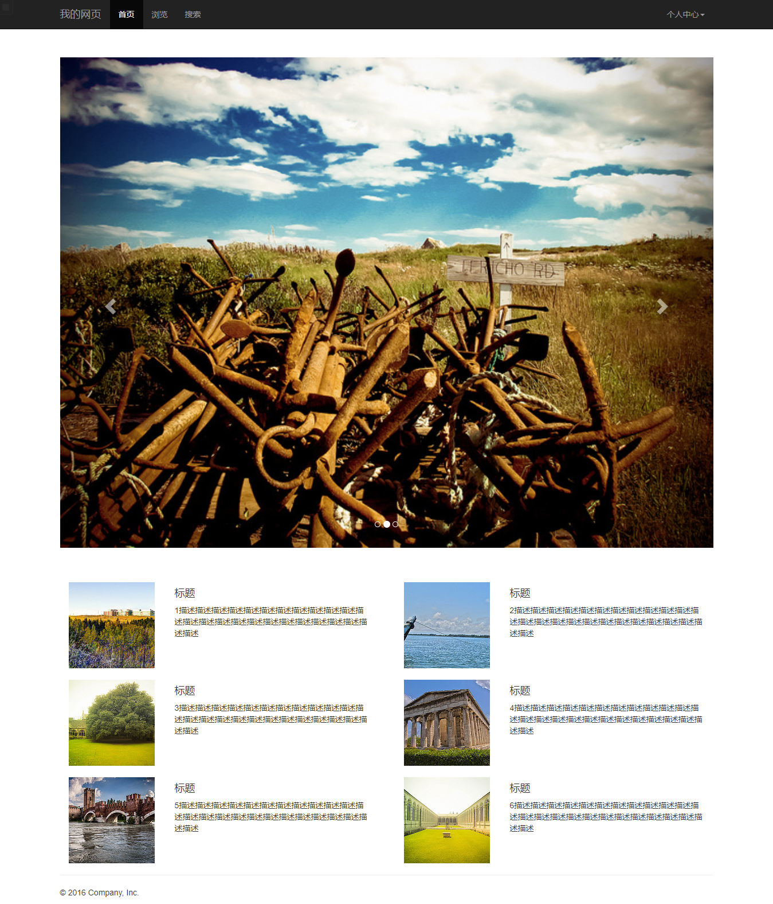

LAB 4 设计文档
==========
本次lab借鉴了多个Bootstrap的模板（包含但不局限于https://v3.bootcss.com/examples/theme/#），如<u>**导航栏左右分离的选项**</u>，用`carousel`来展示<u>**可切换的头图**<u/>，也学到了用样式中的`col-lg-数字`来排版，以及它的`container`做容器等。
主页截图如下：
