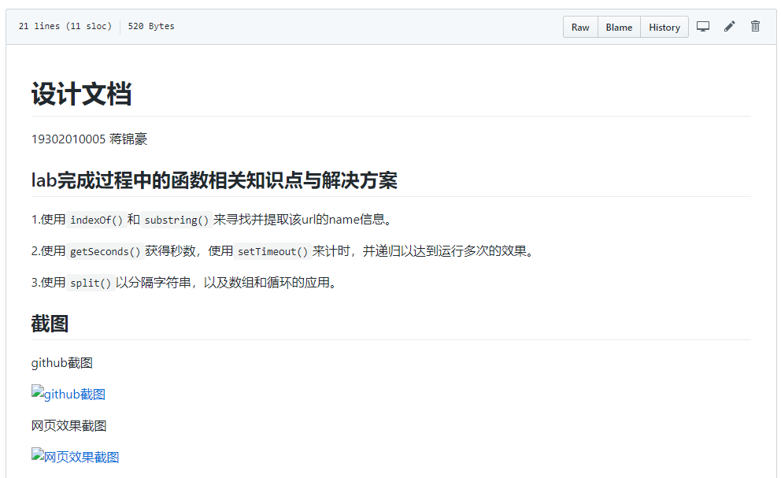
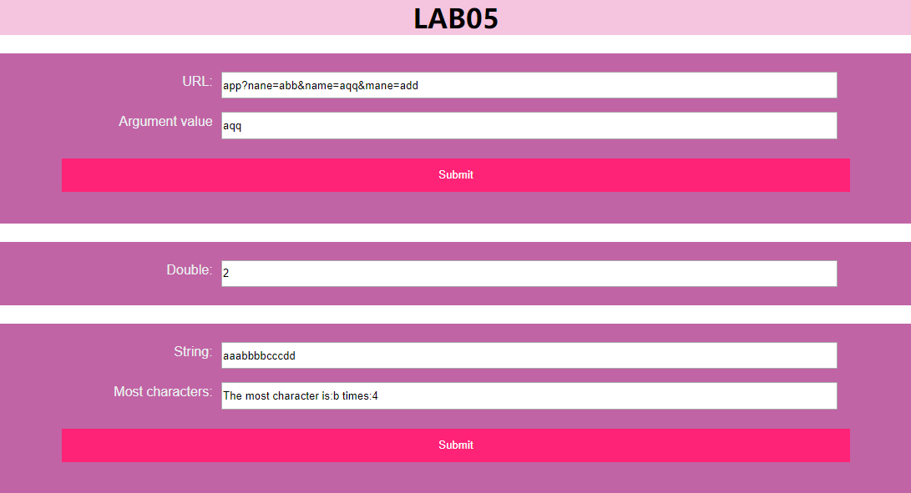

**<h1>设计文档</h1>**

19302010005 蒋锦豪

<h2>lab完成过程中的函数相关知识点与解决方案</h2>

1.使用`indexOf()`和`substring()`来寻找并提取该url的name信息。

2.使用`getSeconds()`获得秒数，使用`setTimeout()`来计时，并递归以达到运行多次的效果。

3.使用`split()`以分隔字符串，以及数组和循环的应用。

<h2>截图</h2>

github截图

网页效果截图

