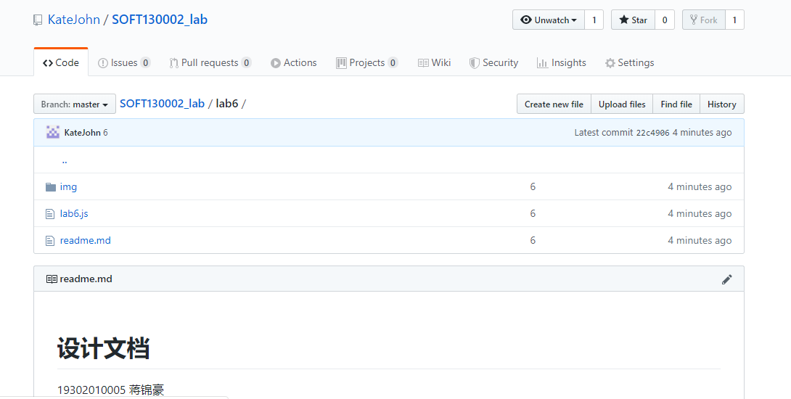
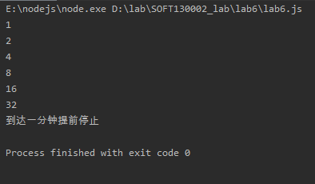
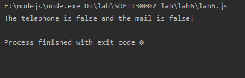
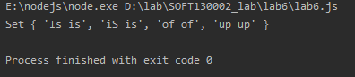
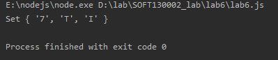
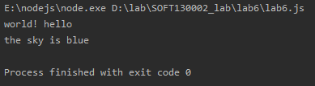
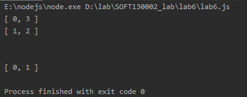
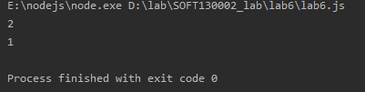
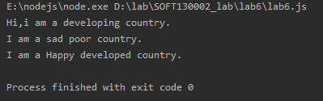

**<h1>设计文档</h1>**

19302010005 蒋锦豪

<h2>①各个正则表达式的解释。</h2>

<h3>2.邮箱理解</h3>

以`数字字母`开头，`@`前面是`数字字母-_`，`@`后面至少两处`数字字母`，顶级域名一般2-4个`数字字母`。

<h3>3.正则匹配的理解</h3>

两个空格之间一样的匹配，用`\1`代表一样的匹配。

<h2>②继承不同方式的理解。</h2>

**构造函数继承**

使用父类的构造函数来增强子类实例，等同于复制父类的实例给子类（不使用原型）。

**原型链继承**

构造函数、原型和实例之间的关系：每个构造函数都有一个原型对象，原型对象都包含一个指向构造函数的指针，而实例都包含一个原型对象的指针。继承的本质就是复制，即重写原型对象，代之以一个新类型的实例。

**原型式继承**

利用一个空对象作为中介，将某个对象直接赋值给空对象构造函数的原型。

<h2>③Map、Set、Array之间的区别和使用。</h2>

`Map`有key和value的一组两个值，但key值不能重复。`Set`不能重复。`Array`可以重复。

<h2>截图</h2>

github

1

2

3

4

5

6

7

8

